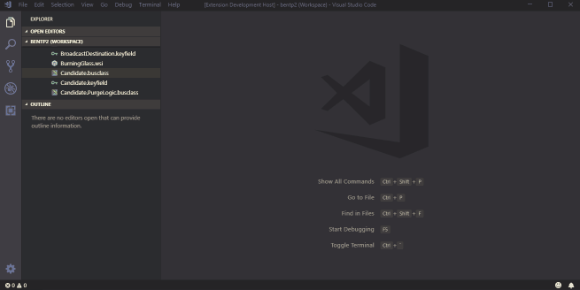
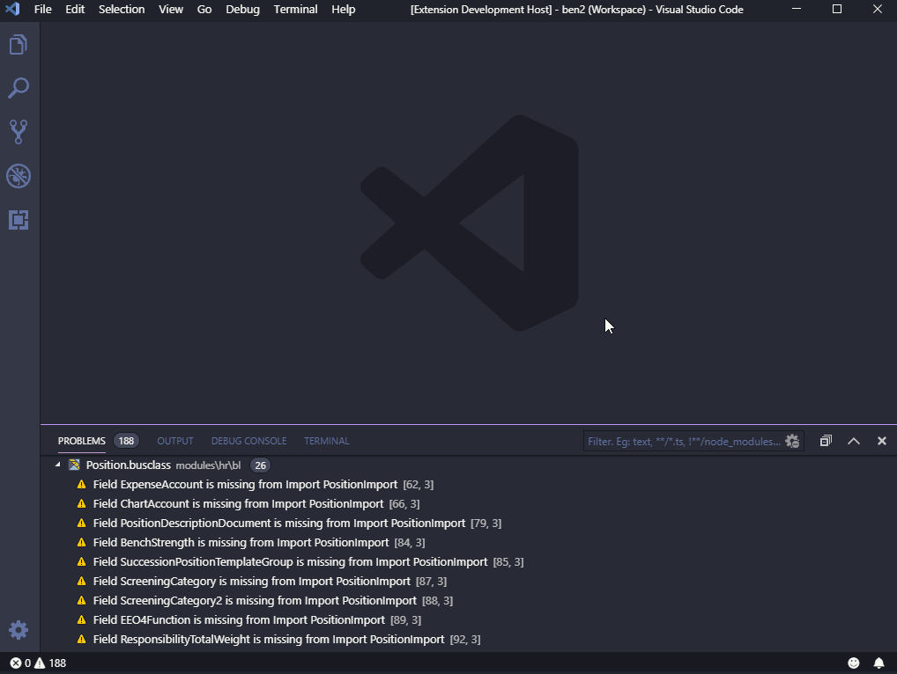

# LPL Outline README

* Provides the necessary data for Visual Studio Code to fill in the Outline panel and breadcrumbs bar for *.busclass files

## Features

* Navigate the code using the outline tree or the breadcrumbs bar.

* Jump to the definition of actions, classes, relations, parameters, etc.
* See definitions of fields and paramters, etc., when hovering over them
* Get warnings about persistent fields missing from import classes

> Tip: The breadcrumbs bar is particularly useful in tracking (displaying) your current location within the file too.

## Requirements	
 
 This extension relies on the Infor LPL Language Server extension already being installed because that declares the busclass file type.

## Extension Settings

* `lpl-outline.detail`
   * `deep`: *(default)* Includes all implemented levels of detail
   * `shallow`: Excludes detail within individual Actions. This is useful in VS Code version 1.31 because the number of symbols in the tree is limited to 7500, and some large files exceed that.

## Known Issues

* Code parsing is imperfect, so jump to definition and hover text is not always accurate or available
* The ability to see a list of all definitions of a parameter or field referenced in the various contexts of a rule block is not implemented (yet).

## Release Notes

See [change log](CHANGELOG.md) for complete history.

### 0.1.6 - 2021-03-03
- Added ability to jump between UI and BL files using Ctrl-Alt-G by default.

-----------------------------------------------------------------------------------------------------------

## Repository

The code for this extension is [hosted at GitHub](https://github.com/bluemonkmn/lpl-outline)
